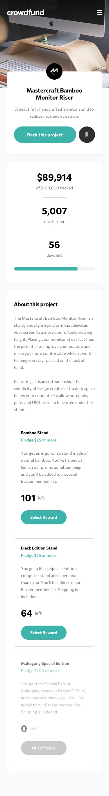

# Frontend Mentor - Crowdfunding product page solution

This is my solution to the [Crowdfunding product page challenge on Frontend Mentor]

# The challenge

Users should be able to:

- View the optimal layout depending on their device's screen size
- See hover states for interactive elements
- Make a selection of which pledge to make
- See an updated progress bar and total money raised based on their pledge total after confirming a pledge
- See the number of total backers increment by one after confirming a pledge
- Toggle whether or not the product is bookmarked

# Screenshot

# Links

- My Solution URL:https://github.com/PRAISE-C24/crowd-funding

- Live Site URL: https://glittering-duckanoo-d9579f.netlify.app/
  /

# Built with

- Semantic HTML5 markup
- Tailwind Css
- React JS
- Mobile-first workflow
- Easy-peasy

# What I learned

State management with easy-pasy

# Useful resources

easy-peasy doc - https://easy-peasy.vercel.app/docs/tutorials/quick-start.html

## Author

- Name - PRAISE CHIBUZOR
- Twitter - @PRAISE_C24
- Frontend Mentor - @PRAISE-C24 (https://www.frontendmentor.io/profile/PRAISE-C24)
